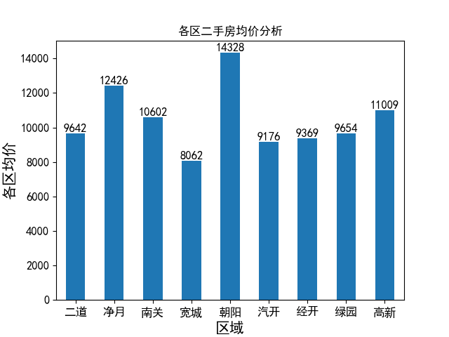
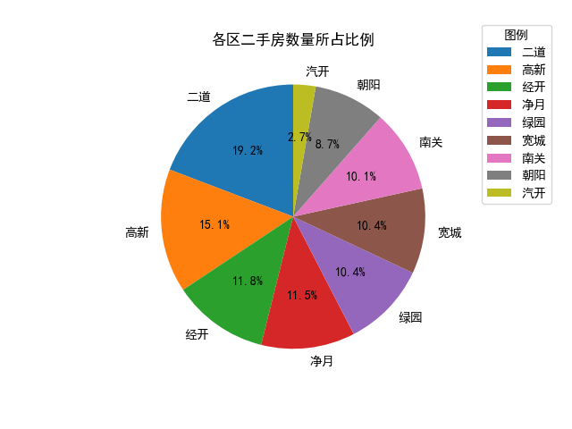

# Readme

# 二手房房价分析与预测系统

### 环境配置

##### 运行

```
python Housing_price_analysis_system/main.py
```

##### 文件夹结构

```
-img/									存储前端系统所需的图像
-result_img/							存储不同功能可视化后得到的图像结果
-data.csv								原始数据
-data_analysis.py						定义原始数据进行处理和可视化的函数
-main.py								程序入口，调用system_menu中定义的类，关联前端系统和实现函数
-Readme.pdf								本文档，阐述系统相关功能和实现
-system_menu.py							通过PyUIC转换system_menu.ui得到的同名python文件
-system_menu.ui							通过Qt5 designer设计得到的系统前端界面
```

##### 库支持

```
PyQt5，matplotlib，pandas，sklearn，re
```

### 主界面

整个界面设计在Qt designer中实现，实现的最终界面如图所示


##### 背景图片

使用`QLabel`部件来插入图片，设置对应的图像为`background.png`，在属性编辑器中，设置`scaledContents`来保证图像和Qlabel部件同步缩放，设置`geometry`参数设置图像的长度和宽度


##### 五个功能按键

功能按键使用`QToolBar`实现，设置如下参数

```
orientation:horizontal
geometry:	长度: 1500	# 设置QToolBar的长度和宽度
			宽度: 800
iconSize:50x50	# 设置QToolBar中QAction的图标长度和宽度
toolButtonStyle: ToolButtonTextUnderIcon	# 设置QToolBar中QAction的图标位于文本之上
```

在`Qtoolbar`中增加了5个`QAction`，用于触发对应功能的函数，包括`各区二手房均价分析`, `各区二手房数量所占比例`, `全市二手房装修程度分析`, `热门户型均价分析`, `二手房售价预测`

对于每个`QAction`，设置如下参数

```
icon: 图标-1.png	# 设置QAction的图标，从本地图片中选取
iconText: 	各区二手房均价分析	# 设置QAction的文本
```

##### 转换为py文件

完成界面设计后，产生`system_menu.ui`，通过Pycharm中的PyUIC外部插件，转换为`system_menu.py`，其中包含一个`Ui_MainWindow`类

### 功能处理

##### 数据预处理

```python
# 数据清洗和预处理
data.drop(data.columns[0], axis=1, inplace=True)    # 清除第一列
data.dropna(how='all', inplace=True)  # 清除全为空的行

data['总价'] = [re.sub('[^0-9.]', '', price) for price in data['总价']]				# 取数值
data['建筑面积'] = [re.sub('[^0-9.]', '', area) for area in data['建筑面积']]		 # 取数值
data['单价'] = [re.sub('[^0-9.]', '', price_per) for price_per in data['单价']]		# 取数值
# Index(['小区名字', '总价', '户型', '建筑面积', '单价', '朝向', '楼层', '装修', '区域'], dtype='object')
data['总价'] = data['总价'].astype(float)		# 强制类型转化，用于后续计算
data['单价'] = data['单价'].astype(float)		# 强制类型转化，用于后续计算
```

##### 各区二手房均价分析，绘制二手房均价的条形图

定义`data_analysis.py`中的`average_price()`函数

根据区域进行分类，计算二手房的均价

```python
data1 = data.groupby(['区域'])['单价'].mean()
```

绘制条形图，在条形图的每个柱上显示二手房的均价（仅保留整数部分）

```python
ax = data1.plot.bar()

# 添加标题和轴标签
plt.title('各区二手房均价分析')
plt.xlabel('区域', fontsize=15)
plt.ylabel('各区均价', fontsize=15)
plt.xticks(fontsize=12, rotation=0)  # 旋转30度
plt.yticks(fontsize=12)
# 在每个柱子上显示数值
for a, b in enumerate(data1):
plt.text(a, b, int(b), ha='center', va='bottom', fontsize=12)
```

使用`plt.show()`时，各个figure之间会出现阻塞，为了保证用户点击每个功能（action）时不必手动关闭当前的figure，在绘制图像前显式关闭当前的图像

```python
plt.close()  # 关闭当前图像窗口

'''图像绘制'''

# 显示图表
plt.show()
```

结果如图



##### 各区二手房数量所占比例，绘制区域二手房数据及占比分析饼状图

定义`data_analysis.py`中的`number_proportion()`函数，只需要根据区域进行分组，统计每个区域取值的出现次数，并绘制饼状图

```python
# 各区二手房数量所占比例
# done
def number_proportion():
    data2 = data['区域'].value_counts()

    # 创建饼状图
    plt.close()  # 关闭当前图像窗口
    data2.plot(kind='pie', autopct='%1.1f%%', startangle=90)
    plt.legend(data2.index, title="图例", loc="upper right", bbox_to_anchor=(1.3, 1.1))

    plt.title("各区二手房数量所占比例")
    plt.ylabel('')  # 删除标签“values”
    plt.show()

    # print(data2)
```

结果如图



##### 全市二手房装修程度分析，绘制装修程度的条形图

定义`data_analysis.py`中的`house_decoration()`函数，只需要根据装修进行分组，统计每个装修取值的出现次数，并如上述方法绘制条形图

```python
# 全市二手房装修程度分析
# done
def house_decoration():
    data3 = data['装修'].value_counts()

    # 可视化
    # 创建条形图
    plt.close()  # 关闭当前图像窗口
    ax = data3.plot.bar()

    # 添加标题和轴标签
    plt.title('全市二手房装修程度分析')
    plt.xlabel('装修', fontsize=15)
    plt.ylabel('套数', fontsize=15)
    plt.xticks(fontsize=12, rotation=0)  # 旋转30度
    plt.yticks(fontsize=12)
    # 在每个柱子上显示数值
    for a, b in enumerate(data3):
        plt.text(a, b, int(b), ha='center', va='bottom', fontsize=12)

    # 显示图表
    plt.show()
```

结果如图


##### 热门户型均价分析，绘制热门户型均价的条形图

定义`data_analysis.py`中的`type_average_price()`函数

先统计各个户型的对应套数，因为可选的户型数量太多了，且很多户型的套数都在20套以内，不方便全部展出在一张图中，因此先对户型的数量进行排序，只显示数量排名靠前的户型的均价，并按照数量排名展示，结果如下，根据数据，我们选取了套数超过50套的户型

```python
num_per_type = data['户型'].value_counts()
popular_type = num_per_type[0:6].index.tolist()

户型
2室2厅1卫    953
2室1厅1卫    571
3室2厅2卫    360
3室2厅1卫    212
1室1厅1卫    164
4室2厅2卫     64
3室1厅1卫     43
2室2厅2卫     38
4室3厅3卫     20
......
```

对于选取的户型统计平均单价

```python
data4 = data.groupby(['户型'])['单价'].mean()
data4 = data4[popular_type]
```

如上述方法绘制条形图

```python
# 可视化
# 创建条形图
plt.close()  # 关闭当前图像窗口
ax = data4.plot.bar()

# 添加标题和轴标签
plt.title('热门户型均价分析')
plt.xlabel('户型', fontsize=15)
plt.ylabel('均价', fontsize=15)
plt.xticks(fontsize=12, rotation=0)  # 旋转30度
plt.yticks(fontsize=12)
# 在每个柱子上显示数值
for a, b in enumerate(data4):
plt.text(a, b, int(b), ha='center', va='bottom', fontsize=12)

# 显示图表
plt.show()
```

结果如图


##### 二手房售价预测，并绘制二手房售价预测折线图

定义`data_analysis.py`中的`price_prediction()`函数

```python
# 二手房售价预测

    plt.close()  # 关闭当前图像窗口
    # 要预测的列
    target = '总价'

    # 选择特征列
    features = ['户型', '建筑面积', '朝向', '装修']

    X = data[features]
    y = data[target]

    # 对于字符型的特征，我们并不能将其直接传输网络模型中进行训练，需要对分类数据进行OneHot（独热)编码
    # Convert categorical variable into dummy/indicator variables.
    # Each variable is converted in as many 0/1 variables as there are different values.
    X = pd.get_dummies(X, columns=['户型', '朝向', '装修'])

    # 拆分数据为训练集和测试集，默认的划分比例为3:1
    X_train, X_test, y_train, y_test = train_test_split(X, y, random_state=42)

    # 创建并训练模型
    model = LinearRegression()
    model.fit(X_train, y_train)

    # 预测
    y_pred = model.predict(X_test)

```

绘制预测价格和实际价格的对比图

```python
# 绘制实际值和预测值的对比折线图
plt.figure(figsize=(12, 6))
plt.plot(y_test.values, label='实际价格', color='blue', marker='o')
plt.plot(y_pred, label='预测价格', color='red', linestyle='dashed', marker='x')
plt.title('二手房售价预测')
plt.ylabel('价格')
plt.xlabel('房屋编号')
plt.legend()
plt.show()
```

结果如图所示


局部放大的结果下图


### QAction对应触发的函数

在`main.py`函数中，定义和调用`MyPyQT_Form`类，利用`action_1.triggered`属性，将`QAction`和对应的函数进行关联

```python
class MyPyQT_Form(QMainWindow, Ui_MainWindow):
    def __init__(self):
        super(MyPyQT_Form, self).__init__()
        self.setupUi(self)

    # 各区二手房均价分析
    @staticmethod
    def act1_average_price(self):
        average_price()
    '''
    其他函数
    '''


if __name__ == '__main__':
    app = QApplication(sys.argv)
    app.setAttribute(Qt.AA_EnableHighDpiScaling, True)   # 启用或禁用高DPI缩放
    my_pyqt_form = MyPyQT_Form()

    my_pyqt_form.action_1.triggered.connect(my_pyqt_form.act1_average_price)
    my_pyqt_form.action_2.triggered.connect(my_pyqt_form.act2_number_proportion)
    my_pyqt_form.action_3.triggered.connect(my_pyqt_form.act3_house_decoration)
    my_pyqt_form.action_4.triggered.connect(my_pyqt_form.act4_type_average_price)
    my_pyqt_form.action_5.triggered.connect(my_pyqt_form.act5_price_prediction)

    my_pyqt_form.show()
    sys.exit(app.exec_())
```


### 完整程序运行如下图

