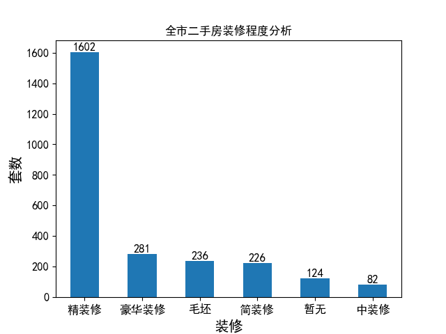
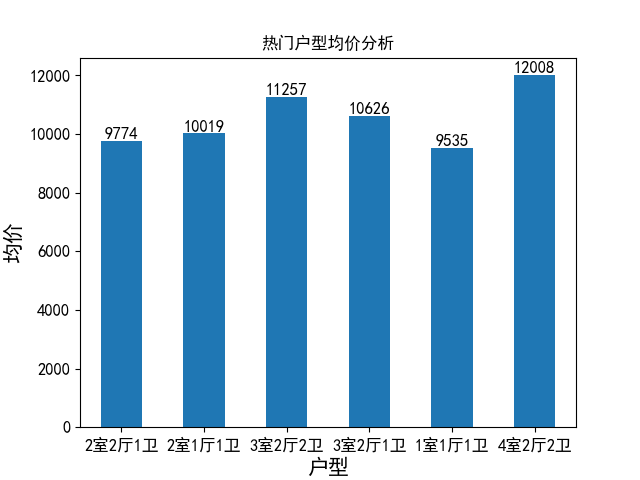

# Readme

# 二手房房价分析与预测系统

### 环境配置

##### 函数运行

##### 库支持

PyQt5


### 主界面

整个界面设计在Qt designer中实现

##### 背景图片

使用`QLabel`部件来插入图片，设置对应的图像为`background.png`，设置scaledContents来保证图像和Qlabel部件同步缩放


##### 五个功能按键

为了使图标显示在文本的上方，你需要修改工具栏的属性

1. 在`Property Editor`中，找到`toolButtonStyle`属性。
2. 将`toolButtonStyle`设置为`ToolButtonTextUnderIcon`

包括`各区二手房均价分析`, `各区二手房数量所占比例`, `全市二手房装修程度分析`, `热门户型均价分析`, `二手房售价预测`


### 功能处理

##### 各区二手房均价分析，绘制二手房均价的条形图

定义`data_analysis.py`中的`average_price()`函数

根据区域进行分类，计算二手房的均价

```python
data1 = data.groupby(['区域'])['单价'].mean()
```

绘制条形图，在条形图的每个柱上显示二手房的均价（仅保留整数部分）

```python
ax = data1.plot.bar()

# 添加标题和轴标签
plt.title('各区二手房均价分析')
plt.xlabel('区域', fontsize=15)
plt.ylabel('各区均价', fontsize=15)
plt.xticks(fontsize=12, rotation=0)  # 旋转30度
plt.yticks(fontsize=12)
# 在每个柱子上显示数值
for a, b in enumerate(data1):
plt.text(a, b, int(b), ha='center', va='bottom', fontsize=12)
```

使用`plt.show()`时，各个figure之间会出现阻塞，为了保证用户点击每个功能（action）时不必手动关闭当前的figure，在绘制图像前显式关闭当前的图像

```python
plt.close()  # 关闭当前图像窗口

'''图像绘制'''

# 显示图表
plt.draw()
plt.pause(0.001)
```

结果如图


##### 各区二手房数量所占比例，绘制区域二手房数据及占比分析饼状图

定义`data_analysis.py`中的`number_proportion()`函数，只需要根据区域进行分组，统计每个区域取值的出现次数，并绘制饼状图

```python
def number_proportion():
    data2 = data['区域'].value_counts()

    # 创建饼状图
    plt.close()  # 关闭当前图像窗口
    data2.plot(kind='pie', autopct='%1.1f%%', startangle=90)
    plt.legend(data2.index, title="图例", loc="upper right", bbox_to_anchor=(1.3, 1.1))

    plt.title("各区二手房数量所占比例")
    plt.ylabel('')  # 这将删除标签“values”，使图看起来更干净
    plt.draw()
    plt.pause(0.001)
```

结果如图


##### 全市二手房装修程度分析，绘制装修程度的条形图


结果如图



##### 热门户型均价分析，绘制热门户型均价的条形图


因为可选的户型数量太多了，且很多户型的套数都在20套以内，不方便全部展出在一张图中，因此先对户型的数量进行排序，只显示数量排名靠前的户型的均价，并按照数量排名展示，结果如下，根据数据，我们选取了套数超过50套的户型

```
户型
2室2厅1卫    953
2室1厅1卫    571
3室2厅2卫    360
3室2厅1卫    212
1室1厅1卫    164
4室2厅2卫     64
3室1厅1卫     43
2室2厅2卫     38
4室3厅3卫     20
```

结果如图



##### 二手房售价预测

二手房售价预测折线图

